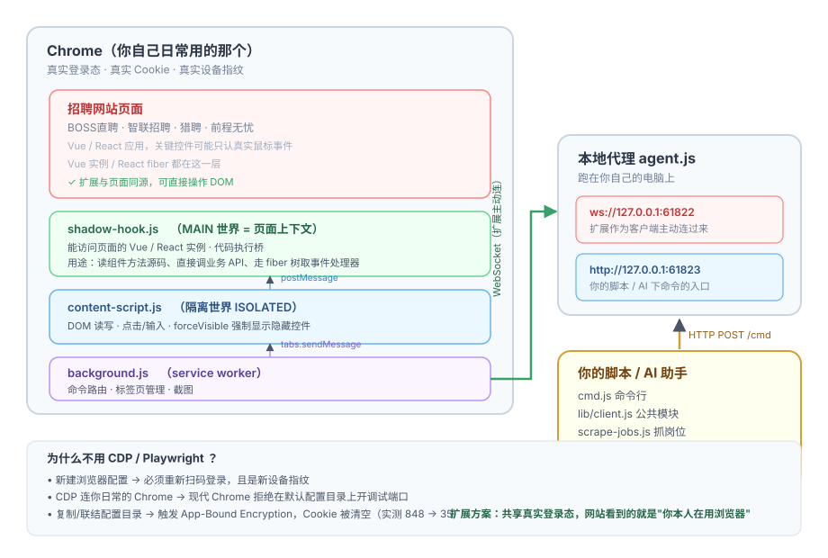

# AI 求职自动化 —— 浏览器扩展方案

[中文](README.md) | **English** → [`README.en.md`](README.en.md)

用 AI 代替人操作招聘网站：看职位、读 JD、投简历、和 HR 聊天。

**核心思路：不启动新浏览器、不用 CDP、不复制用户配置，而是装一个浏览器扩展，在你**真实登录的 Chrome** 里干活。**

> 📖 **第一次用？请看保姆级教程：[`docs/TUTORIAL.md`](docs/TUTORIAL.md)**
>
> 从装 Node.js 开始，一步步带你装扩展、起代理、抓岗位、筛选、投递，并教你配合 AI 助手使用。**读完就能上手。**

---

## 为什么不用 Playwright / Selenium / CDP

| 方案 | 问题 |
|---|---|
| Playwright 新建浏览器 | 需要重新登录（扫码），且是新设备指纹 |
| CDP 连接用户 Chrome | Chrome 154+ 拒绝在默认配置目录上开调试端口 |
| 复制配置目录 | 触发 App-Bound Encryption，**Cookie 被清空**（实测 848 → 35） |
| 目录联结（junction） | 同样触发 ABE（实测 848 → 45），且原配置有损坏风险 |

**扩展方案的优势**：跑在用户真实浏览器里，共享真实 Cookie、真实指纹、真实登录态。网站看到的就是「用户本人在用浏览器」。

---

## 架构



下面同一张图的文字版（方便复制到别处）：

```
┌─────────────────┐   chrome.tabs.sendMessage   ┌──────────────────┐
│  浏览器扩展      │ ◄──────────────────────────► │  内容脚本         │
│  background.js   │                              │  content-script  │
│  (service worker)│                              │  (ISOLATED 世界)  │
└────────┬─────────┘                              └────────┬─────────┘
         │                                                 │ postMessage
         │ WebSocket (扩展是客户端)                          ▼
         │                                        ┌──────────────────┐
┌────────▼─────────┐                              │  MAIN 世界脚本    │
│  本地代理         │                              │  shadow-hook.js  │
│  agent.js         │                              │  (可访问页面 JS)   │
│  ws://:61822      │                              └──────────────────┘
│  http://:61823    │ ◄── 你的脚本 / AI 通过 HTTP 下命令
└───────────────────┘
```

**为什么要有 MAIN 世界脚本**：内容脚本运行在隔离世界，拿不到页面的 Vue / React 实例。有些网站的关键控件只认真实鼠标事件（合成事件无效），这时必须走页面上下文。

---

## 快速开始

> 想看详细的分步教程（含截图说明、排错清单、AI 助手配合用法），请直接看 **[`docs/TUTORIAL.md`](docs/TUTORIAL.md)**。下面是精简版。

### 1. 装扩展

```
Chrome → chrome://extensions → 打开「开发者模式」→「加载已解压的扩展程序」→ 选 extension/ 目录
```

### 2. 起代理

```bash
cd agent
npm install ws     # 或 pnpm add ws
node agent.js
```

看到 `✅ 扩展已就绪` 即成功。

### 3. 下命令

```bash
node cmd.js goto "https://www.zhipin.com/web/geek/jobs?query=Java&city=101280100"
node cmd.js read
node cmd.js extract
node cmd.js screenshot
```

---

## 命令参考

| 命令 | 说明 |
|---|---|
| `goto <url>` | 打开页面 |
| `read` | 读页面纯文本 |
| `extract` | 读页面结构化 markdown（**带链接地址**） |
| `scan` | 列出可交互元素及编号 |
| `query {selector,limit}` | 按 CSS 选择器查元素（含位置、可见性） |
| `clickSel {selector,nth}` | 点元素 |
| `typeSel {selector,nth,text,submit,fast}` | 输入文字；`fast:true` 用于长文本 |
| `pageEval {code}` | **在页面主世界执行 JS** |
| `screenshot` | 截图存到 `shots/` |

---

## 核心技术：绕过「合成点击无效」的控件

**症状**：`el.click()` 和完整的事件序列都发出去了，页面毫无反应。

**根因**：网站用框架（Vue / React）管理状态，只认真实用户交互；有些控件的显隐靠 CSS `:hover`，合成的 hover 事件触发不了。

**解决方案（四级递进）**：

### 第 1 级：强制显示 + 完整事件序列

```js
// content-script.js — forceVisible()
// ⚠️ 关键坑：设成 '' 只是清空内联样式，会回退到 CSS 的 display:none，等于没改
node.style.setProperty('display', 'block', 'important');   // ✅ 必须显式覆盖
node.style.setProperty('visibility', 'visible', 'important');
node.style.setProperty('pointer-events', 'auto', 'important');
```

### 第 2 级：点对元素

包装元素（`<div class="btn-box">`）常常没有事件处理器，真正带事件的是内层 `<button>` 或 `<a>`。

```js
// ❌ 按文档顺序第一个匹配的是外层 DIV
querySelectorAll('button, a, span, div')[0]
// ✅ 指定标签
querySelectorAll('button')[0]
```

### 第 3 级：Vue —— 直接调组件方法

```js
// 1. 找元素上挂的 Vue 实例
let n = document.querySelector('.target'), d = 0, vue = null;
while (n && d < 15) { if (n.__vue__) { vue = n.__vue__; break; } n = n.parentElement; d++; }

// 2. 读方法源码，找真正调 API 的那个（关键！）
vue.$options.methods.handleSave.toString()
// → function(e){ this.$refs[e].validate(ok => ok && this.saveSelfInfo()) }
//   ↑ handleSave 只是校验包装，saveSelfInfo 才调 API

// 3. 直接调用业务方法
vue.advantageForm.desc = '新内容';
vue.saveSelfInfo();     // 绕过 UI 校验，直达 API
```

### 第 4 级：React —— 走 fiber 树拿事件处理器

```js
// React 16/17：元素上是 __reactInternalInstance$xxx（不是 __reactProps$）
const key = Object.keys(el).find(k => k.startsWith('__reactInternalInstance'));
let fiber = el[key];
while (fiber) {
  const props = fiber.memoizedProps || fiber.pendingProps;
  if (typeof props.onClick === 'function') {
    props.onClick({ preventDefault() {}, stopPropagation() {} });
    break;
  }
  fiber = fiber.return;   // 沿 fiber 树向上
}
```

> React 17+ 也可能直接在元素上挂 `__reactProps$xxx`，两种都试。

**实例**：猎聘的工作经历删除按钮是 `display:none`（悬停显示），React 16 实现。用上面的方法拿到 `onClick` 并调用，弹出确认框，再点 `.ant-modal-confirm-btns .ant-btn-primary` 完成删除。

---

## 踩过的坑（血泪清单）

| 坑 | 现象 | 解法 |
|---|---|---|
| **字段字数上限** | 写入成功但保存无效 | 先读「还可输入 N 个字」提示。智联个人优势上限 **500 字** |
| **日期必须回车确认** | 显示有值但校验报「请选择时间」 | `typeSel` 加 `submit: true` |
| **`display:''` 无效** | 强制显示后元素仍无布局盒子 | 用 `setProperty(..., 'important')` |
| **Ant Design 按钮文字带空格** | 正则 `^确定$` 匹配不到「确 定」 | 用类名 `.ant-btn-primary`，别用文字 |
| **`pageEval` 返回对象** | 拿到 `[object Object]`，误写入简历 | 页面内先 `JSON.stringify`；**写回前务必核对** |
| **`pageEval` 只收表达式** | `Unexpected token ';'` | 代码包成 IIFE：`(function(){ ... })()` |
| **会话列表虚拟滚动** | 扫不到目标会话 | 用「未读」标签 + 搜索框，别只依赖列表 |
| **扩展改了不生效** | 新命令报 `Unknown` | Chrome 不会热重载扩展，**必须手动点重载** |
| **跳转后立刻执行 `pageEval`** | 报「命令 pageEval 超时」 | 点击导致跳转后要等 5～7 秒，内容脚本才注入完成 |
| **`NAVAGENT_PORT` 命名冲突** | 改 WebSocket 端口会悄悄弄坏 HTTP 客户端 | HTTP 用 `NAVAGENT_HTTP_PORT`，WebSocket 用 `NAVAGENT_PORT` |

---

## 反风控经验

- **不要依赖程序批量投递 Boss**：BOSS直聘 是唯一有主动反自动化机制的平台。当天触发风控就停，第二天再投。
- **人类节奏**：每个动作间隔 2-5 秒，批次之间 15-25 秒，别连续高频。
- **每日上限**：BOSS直聘 沟通数通常 100/天，留余量。
- **绝不绕过验证码**：遇到就停，交给人。
- **优先低频平台**：智联 / 前程无忧 / 猎聘 风控远松于 BOSS直聘，适合走量。

---

## 代码示例

`agent/examples/` 下是可直接跑的完整示例（用 `agent/lib/client.js` 公共模块）：

| 文件 | 演示的技法 |
|---|---|
| `vue-call-api.js` | **Vue**：读方法源码找到真正的 API 方法，绕过失效的 UI 校验直接调用 |
| `react-fiber-click.js` | **React 16**：走 fiber 树拿到 `onClick`，点开隐藏按钮 + 处理 Ant Design 确认框 |
| `resume-audit.js` | 多平台简历审计：批量检查编造数据、缺失内容、文本损坏 |

`lib/client.js` 是共用基础模块：

```js
const { pe, goto, extract, nap } = require('./lib/client');

await goto('https://example.com');
const md = await extract();                    // 结构化 markdown（带链接）
const title = await pe('document.title');    // 页面主世界执行 JS
```

---

## 配合 AI 助手使用

**这套工具本身只是「手和眼睛」** —— 它能打开网页、读内容、点按钮，但**不理解内容**。

真正让它有价值的是配合 AI 助手（DeepSeek Harness、Claude Code、Cursor 等能执行命令的助手）：你把需求告诉它，它来读 JD、写招呼语、分析 HR 回复、按需改脚本。

完整的开场提示词、对话示例和三条红线，见教程的 [进阶章节](docs/TUTORIAL.md#进阶配合-ai-助手一起用)。

**三条红线：**

1. **不让 AI 编造经历** —— 它写得很漂亮，但必须是你真做过的事
2. **不让 AI 写没依据的数字** —— "提升 40%" 面试一问就穿帮
3. **涉及承诺的事你拍板** —— 面试时间、期望薪资、到岗时间，AI 起草，你确认

---

## 目录结构

```
├── extension/          浏览器扩展（MV3）
│   ├── manifest.json
│   ├── background.js       service worker：路由命令、截图
│   ├── content-script.js   隔离世界：DOM 操作、forceVisible、pageEval 桥
│   ├── shadow-hook.js      MAIN 世界：Vue/React 访问、代码执行桥
│   └── lib.js
├── agent/              本地代理 + 自动化脚本
│   ├── agent.js            WebSocket(:61822) + HTTP(:61823)
│   ├── bridge.js           扩展连接管理
│   ├── cmd.js              命令行客户端
│   ├── lib/client.js       公共模块（推荐用这个写脚本）
│   ├── examples/           技法示例（见上）
│   ├── scrape-jobs.js      岗位抓取
│   ├── apply-jobs.js       投递流水线（含按 JD 定制招呼语）
│   └── rank-jobs.py        岗位过滤 + 匹配度打分
├── resume/             简历生成（个人信息放在 gitignore 的 profile.json）
│   ├── build_resume.py     从 profile.json 生成 Word 简历
│   └── profile.example.json  模板
├── docs/
│   ├── TUTORIAL.md         保姆级教程
│   └── architecture.svg
├── tools/
│   └── gh-api-push.js      网络受限时用 REST API 推送（见下）
└── data/               岗位数据（已 gitignore）
```

---

## 推不上去？用 `tools/gh-api-push.js`

如果你所在网络 **`github.com:443` 连不上、但 `api.github.com` 通**（国内常见），`git push` 会失败：

```
fatal: unable to access 'https://github.com/...': Failed to connect to github.com
```

这时用这个工具，它走 GitHub 的 Git Data API 推送，**全程只碰 `api.github.com`**：

```bash
node tools/gh-api-push.js <用户名>/<仓库名> main --message "提交信息"
```

它做的事：`git ls-files` 列出要提交的文件 → 逐个建 blob → 建 tree → 建 commit → 更新 ref。
**完全遵守 `.gitignore`**（因为用 `git ls-files` 取文件列表），不需要 `git push`。

Token 从 `GITHUB_TOKEN` 环境变量读，没有就调 `gh auth token`（需先 `gh auth login`）。

---

## 端口与环境变量

| 变量 | 默认 | 作用 |
|---|---|---|
| `NAVAGENT_HOST` | `127.0.0.1` | 代理地址（脚本侧） |
| `NAVAGENT_HTTP_PORT` | `61823` | **脚本下命令**的 HTTP 端口 |
| `NAVAGENT_PORT` | `61822` | **扩展连接**的 WebSocket 端口 |

> ⚠️ 这两个端口是独立的，别搞混：61822 是「扩展 → 代理」，61823 是「你 → 代理」。
> 改 WebSocket 端口时，扩展选项页里的端口也要同步改。

---

## 许可与免责

仅供个人求职使用。使用者需自行承担因自动化操作导致的账号风险，并遵守各招聘平台的服务条款。

**请勿用于批量骚扰 HR、虚假投递或任何欺诈行为。**
